# Website Deployment on AWS using Custom VPC and Monitoring

## Project Overview
This project demonstrates hosting a scalable and highly available website on **AWS** by creating a **Custom VPC** with **Auto Scaling**, **Application Load Balancer**, and monitoring via **CloudWatch**. It also integrates **Simple Notification Service (SNS)** for real-time alerts and notifications, ensuring continuous availability, scalability, and operational visibility.

🔗 **GitHub Repository:** [Website_Deployment_on_AWS](https://github.com/AmitJha2112/Website-Deployment-AWS-Terraform)

---

## Features
- **Custom VPC** for secure and isolated networking
- **Auto Scaling** for handling varying traffic loads
- **Application Load Balancer** for distributing requests
- **CloudWatch Monitoring** with alarms and dashboards
- **AWS SNS** for instant notifications
- **Secure Database Deployment** in private subnet

---

## 🛠 Project Implementation Steps

### 1. Create a Custom VPC
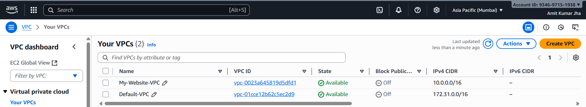

### 2. Create Subnets (Public & Private)
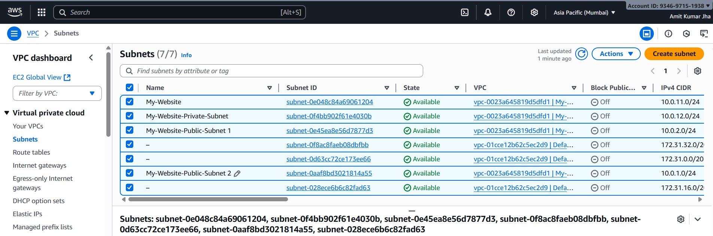

### 3. Create an Internet Gateway
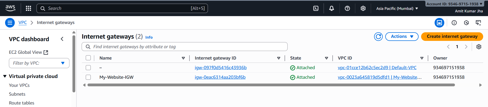

### 4. Create a NAT Gateway
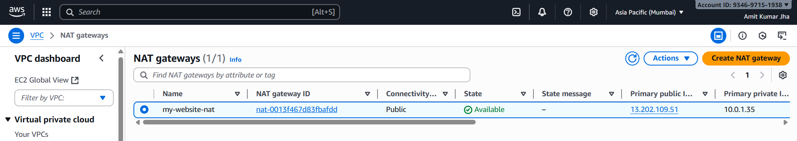

### 5. Create Route Tables (Public & Private)
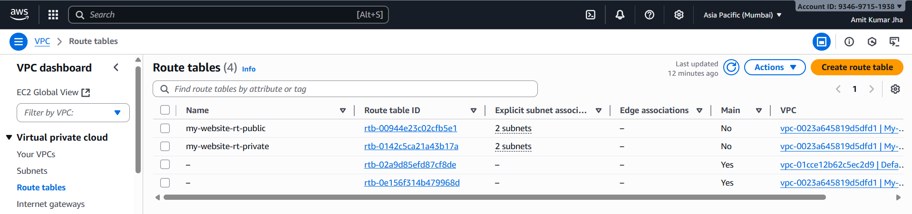

### 6. Create Security Group (Ports 22, 80)
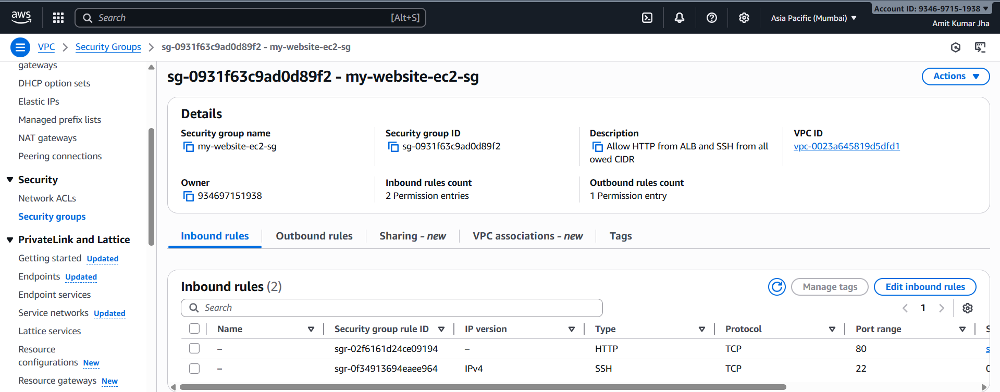

### 7. Create an SNS Topic
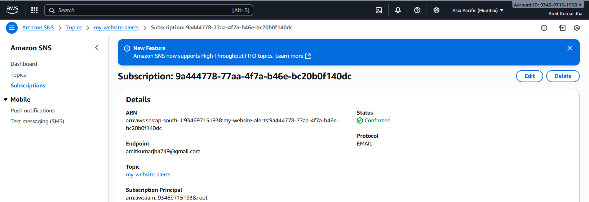

### 8. Create an Empty Target Group
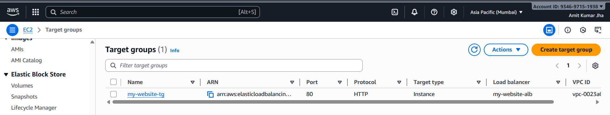

### 9. Create an Application Load Balancer
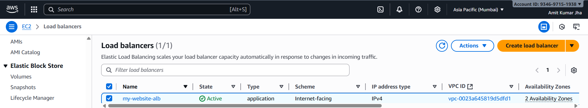

### 10. Create Launch Template
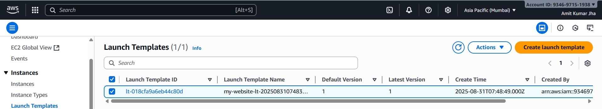

### 11. Create an Auto Scaling Group
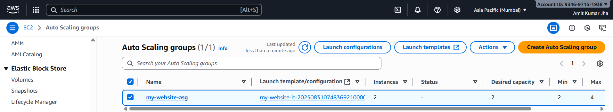

### 12. Create CloudWatch Alarms
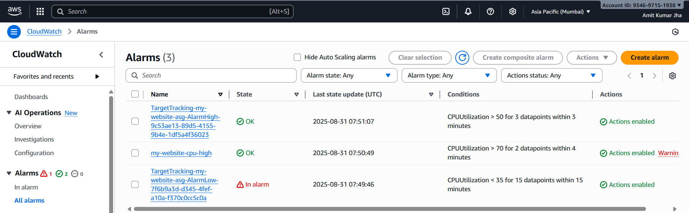

### 13. Create CloudWatch Dashboard
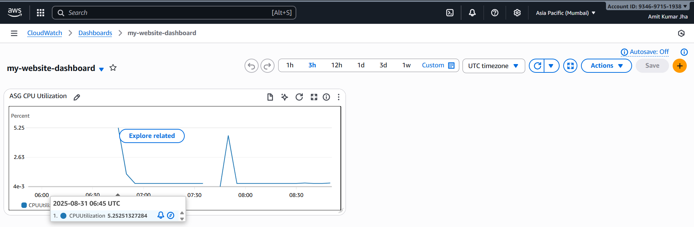

### 14. Attach Domain to Load Balancer
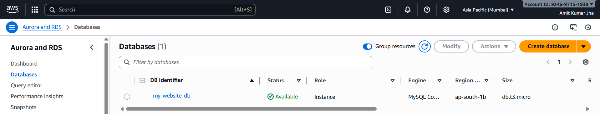

### 15. Launch Database in Private Subnet
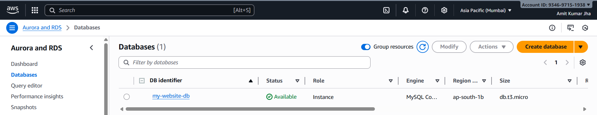
---

##  Website Outputs

### Public IP Outputs
- **Webserver 1 Output**  
  

### Load Balancer & Domain Outputs
- **Application Output via Load Balancer DNS**  
  
- **Final Deployed Website Home Page with Domain**  
  
- **About Page via Domain**  
  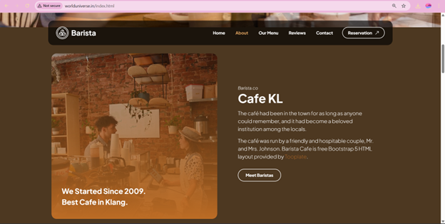
- **Our Menu Section**  
  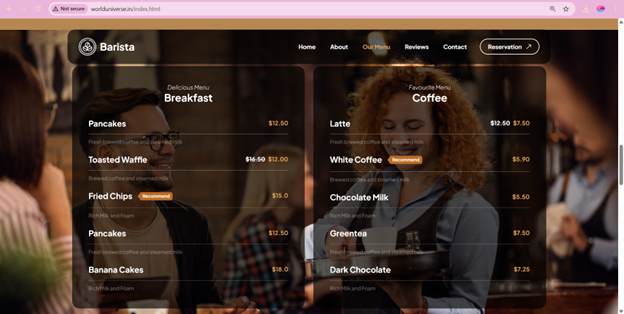
- **Customer Reviews Section**  
  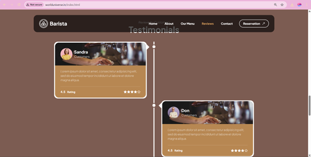
- **Contact Page**  
  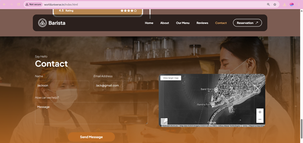

---

##  Project Architecture
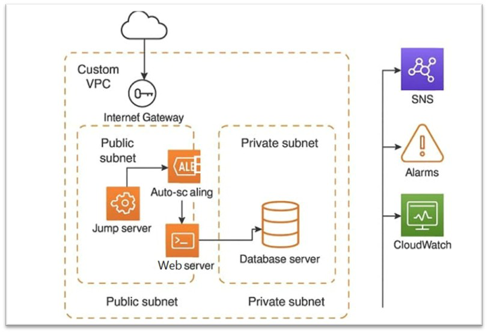

---

##  Summary
- Hosted a **scalable & highly available website** on AWS using a **Custom VPC**  
- Implemented **Auto Scaling** and **Application Load Balancer** for traffic management  
- Enabled **CloudWatch Monitoring** with alarms and dashboards  
- Integrated **SNS Notifications** for real-time alerts  
- Secured the architecture by placing the **database in a private subnet**  

---

##  Summary
- Hosted a **scalable & highly available website** on AWS using a **Custom VPC**  
- Implemented **Auto Scaling** and **Application Load Balancer** for traffic management  
- Enabled **CloudWatch Monitoring** with alarms and dashboards  
- Integrated **SNS Notifications** for real-time alerts  
- Secured the architecture by placing the **database in a private subnet**  

---
